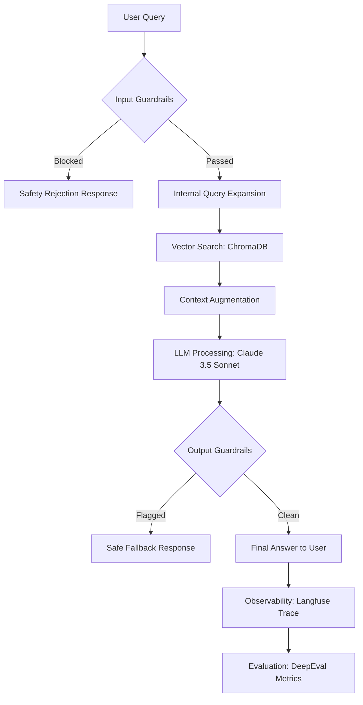

# 🤖 Agent Lifecycle: BofA-Compliant RAG Demo

This document outlines the step-by-step lifecycle of a single query through our AI Agent architecture, emphasizing the **Responsible AI** layers.

---

## 🔄 The Lifecycle Flow

### 1. Input Validation (Safety Filter)
- **Prompt Injection Detection**: Scanning for "jailbreak" attempts (e.g., "god mode", "ignore previous instructions").
- **PII Detection**: Identifying Social Security Numbers, Credit Cards, or emails.
- **Toxicity/Ban Topics**: Ensuring the query adheres to financial compliance and respectful language.

### 2. Information Retrieval (The "R")
- **Semantic Search**: The query is converted to a vector embedding.
- **Context Fetching**: The 5 most relevant document chunks are retrieved from our BofA compliance PDF database.

### 3. Generation (The "G")
- **Augmentation**: The prompt is wrapped with retrieved context + strict system instructions.
- **Reasoning**: Claude 3.5 Sonnet generates a response based *only* on the provided context (to prevent hallucinations).

### 4. Output Validation (The "Safety Net")
- **Hallucination Check**: Ensuring the model didn't invent facts outside the context.
- **No-Refusal Policy**: Verifying the model didn't incorrectly refuse a benign query.
- **Sensitive Data Scrubbing**: Final scan as the text leaves the system.

### 5. Observability & Feedback Loop
- **Langfuse Tracing**: Tracking the timing and cost of every step.
- **DeepEval Scoring**: Running "LLM-as-Judge" to score the response on Faithfulness and Relevancy.

---

## ⚖️ Thresholds & Sensitivity
Currently, the system is tuned at a **0.5 sensitivity threshold** for scanners:
- **Low (0.8)**: Permissive, catches only obvious attacks.
- **Medium (0.5)**: Balanced compliance (Current Setting).
- **High (0.2)**: Strict, used for high-risk financial data.
